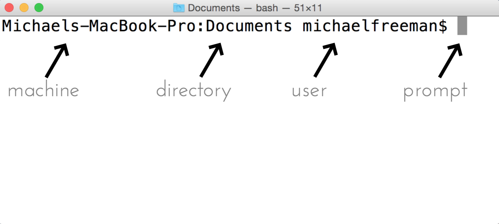
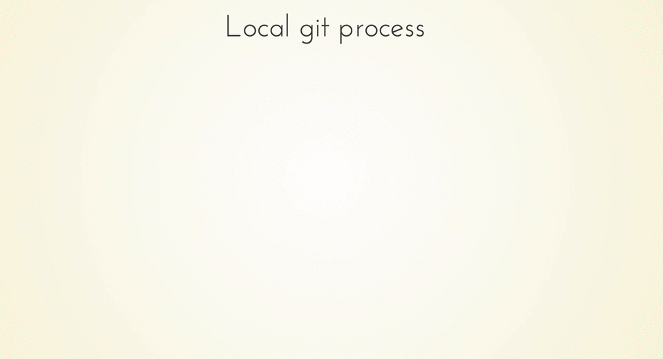
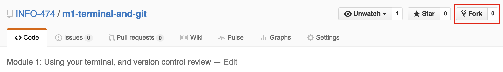
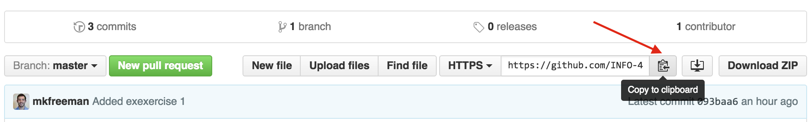
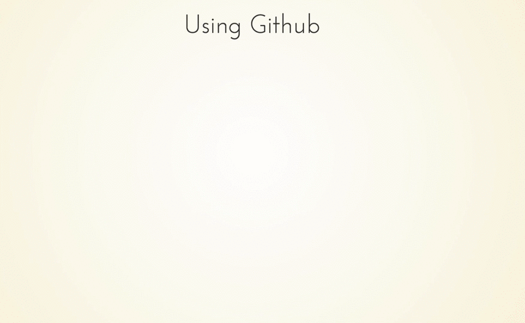

# Module 1: Terminal and Git

## Overview
In this module, we'll review the basics of using the command line terminal, as well as the foundations of version control using the `git` language, and `GitHub`.  More specifically, we'll cover these skills:

- Navigating your file structure using the command line
- Introduce the syntax of version control using `git`
- Set up `GitHub` as a remote host for your `git` managed projects

** Note **: The terminal instructions are written for mac users, and may require different syntax for other operating systems such as Windows or Linux.  For Windows, you may want to download a command line interface such as [Git Bash] [Powershell](https://www.microsoft.com/en-us/download/details.aspx?id=40855).

## Resources
Here are some helpful outside resources:

- [Introduction to the mac command line](http://www.macworld.co.uk/feature/mac-software/get-more-out-of-os-x-terminal-3608274/)
- [Mac terminal cheatsheet](https://github.com/0nn0/terminal-mac-cheatsheet/wiki/Terminal-Cheatsheet-for-Mac-(-basics-)
- [Try Git](https://try.github.io/levels/1/challenges/1): An interactive tutorial for learning `git`
- [Git Documentation](https://git-scm.com/documentation)
- [Setting up git](https://help.github.com/articles/set-up-git/) (with GitHub)
- [Git command line reference](https://git-scm.com/docs)
- [Git Introductory Videos](http://git-scm.com/videos)
- [Git cheatsheet](https://training.github.com/kit/downloads/github-git-cheat-sheet.pdf)

## Terminal Use
In order to move forward in this course, there are a few basic commands you'll need to know on the command line.  We'll use the terminal for two primary purposes:

- Running a local web server
- Engaging our version control systems

A simple way to open your terminal is to open your Spotlight Search, type in the word _terminal_, and hit `enter`.  This should open up a terminal window that tell you the **machine** you're using, the **directory** you're currently in, the current **user**, and provides a command prompt for you to type instructions:



### Basic Commands

Here is a short-list of commands you'll use to navigate your file structure and create files/directories (a good list is compiled [here](https://github.com/0nn0/terminal-mac-cheatsheet/wiki/Terminal-Cheatsheet-for-Mac-(-basics-))):

| Command  | Function |
| ------------- | ------------- |
| `cd DIRNAME` | change directory to DIRNAME |
| `clear`  | clears terminal  |
| `history`  | shows history of commands |
| `history &#124; grep SEARCH`  | shows history that matches the SEARCH term|
| `ls`  | list contents of diretory  |
| `ls -a`  | list all contents  |
| `mkdir DIRNAME` | make a directory with name DIRNAME|
| `pwd` | print working directory |
| `rm file` | remove (delete) a file |


**Some quick tips**:

- If you start typing a command or a directory name, you can hit the `tab` key to auto-complete the word.  
- You can use the tilde (`~`) to signify the home directory of the logged in user.  In other words, instead of typing `cd /Users/username/Documents`, you can just type `cd ~/Documents`.  This both saves time, and makes it easier to write code that runs on multiple machines.
- To change directory to the parent directory one level above the current directory, use the `..` shorthand.  For example, to enter a sibling directory, you may say `cd ../sibling`.   

To practice using these basic commands, see [exercise-1](exercise-1).

### Running a local server
In addition to managing our files, we'll use the terminal to run a local web server.  While this may sound involved, it's really only one line of code:

```
# Start running a local server in your current directory
python -m SimpleHTTPServer 8080
```
The files in your current directory will then be accessible in your web browser at `localhost:8080`.

If you're on windows, you may prefer to install a GUI tool like [WAMP](http://www.wampserver.com/en/).

## Version control
This is a brief review of basic version control operations using `git` and `GitHub`.  When programmatically building interactive data visualizations, it's imperative that you're able to track changes to your code, share your code, and collaboratively code with other developers.  We'll cover collaboration in a later module, but if you don't feel comfortable using the basics of these systems, **make sure to practice now**.

### Git
`Git` is a free and open-source version control software that provides you with a set of command line tools for tracking changes to your files.  All of the files in a project directory (referred to as a `repository`, or `repo`) are tracked by a hidden `.git` file in the root of the project.  You can initiate a repository with the `git init` command.  

Git allows you to roll back to a previous snapshot of your project called a `commit`.  When you want to take a snapshot of your work, you'll need to `add` your the changes to your files to a **staging area**.  You can think of a staging area (literally) like a staging area.  The changes that you want to be included in your next snapshot need to be put on stage in order to be captured by the `commit`.  Each time you take a snapshot (`commit`), you'll need to include a short message that describes the set of changes.  These steps fit together as follows:



Here is additional information on each (of these) `git` commands (note, this **_is not_** a full list -- see [documentation](https://git-scm.com/docs)):

| Command  | Function |
| ------------- | ------------- |
| `git init` | Initialize a new repository in the current directory|
| `git status`  | Tells you the current status of the git repository. It also often tells you what commands to execute next. If you are in doubt, execute git status and read what it says carefully!  |
| `git add FILE-NAME` or `git add .`  | Adds a file or files (`.`) to the staging area. All changes to those files will be included in the next commit. |
| `git commit -m "Description"`  | Commits all changes to all files currently in the staging area to the repository.|


### GitHub
The `git` process described thus far all happens on your local machine.  In order to share our code and collaborate with other, we'll need a publicly accessible location where we can store our files -- that's what GitHub is for.  

GitHub is the most popular open-source web-based repository hosting service.  In addition to providing a great UI on top of a server that hosts your repositories, GitHub has a number of additional features such as issue tracking, wiki pages, and notifications that make it a great collaboration tool.  

The important thing to keep in mind is that GitHub doesn't just store the files in your repository -- it stores the **entire database of changes** to the files, allowing other developers to view the files at an earlier point in time.  

Here is an example of one workflow you may choose when working with a project.  First, you may want **your own copy** of a repository on GitHub.  To create your own copy, you'll simply click the **fork** button in a repository:



That will create a copy of the **entire repo** on your GitHub account.  In order to start working on the files, you'll need to get them on your computer.  To do so, you will clone **your forked repository** (_not_ the original one) to your machine.  You can easily get the url by clicking the clipboard icon:



Then, on your terminal, you could use the `git clone` command described below.  Here is a diagram of the full process:




Here are additional `git` commands that allow you to interact easily with GitHub:

| Command  | Function |
| ------------- | ------------- |
| `git clone REPO-URL` | Creates a new copy of a source repository, which typically exists on a remote server. Use this when you want to clone down a GitHub repository. This command will create a new subdirectory with the same name as the source repository. |
| `git push origin master`  | Pushes all commits on the `master` branch made since the last push to another repository (`origin`), typically across the network (e.g., to GitHub)  |
| `git pull`  | Pulls all commits made since the last pull from another repository, and attempts to merge those changes into your current files. |
| `git config` | Configure your GitHub account. You should run `git config --global user.name "Your Full Name" and `git config --global user.email your-github-email` to initially set up. |

To practice using these basic commands, see [exercise-2](exercise-2).
